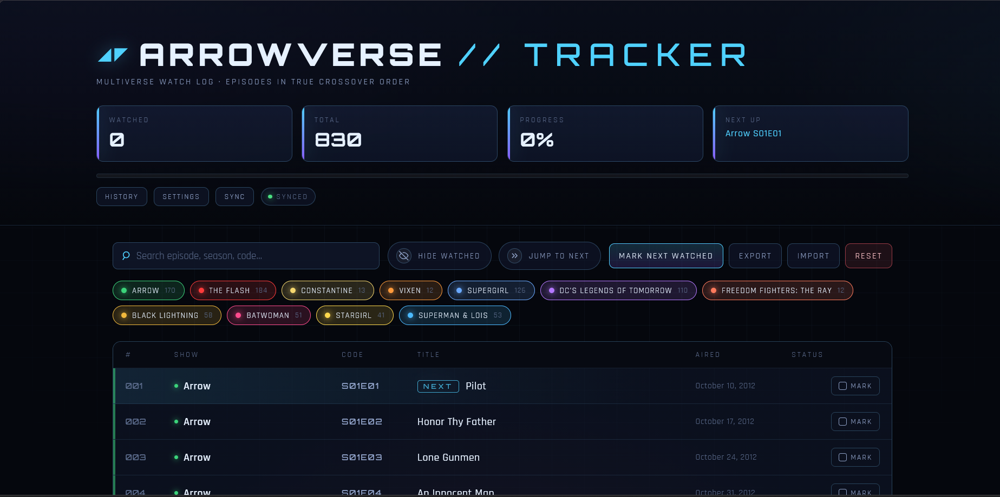
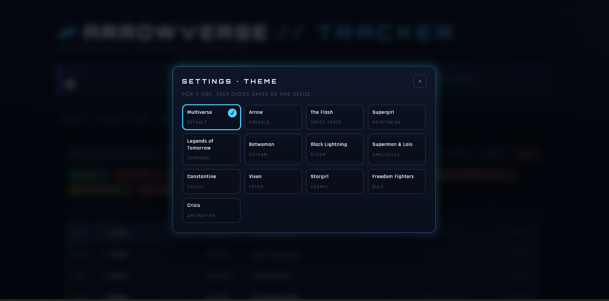

# Arrowverse Tracker

A **local-first, self-hosted PWA** for tracking your Arrowverse watch
progress in true crossover order. Dark sci-fi aesthetic, 13 built-in themes
(one per show), installable on phone and desktop, and every device on your
Wi-Fi syncs to the same watch log.

830+ episodes across 11 shows, ordered by air date, sourced from
[arrowverse.info](https://arrowverse.info/) (built on
[AceFire6/ordered-arrowverse](https://github.com/AceFire6/ordered-arrowverse)).

## Highlights

- **Server-authoritative progress** - your laptop runs a tiny Node server;
  phone and desktop both sync to the same `data/progress.json`.
- **Full history log** - every mark / unmark / reset is stamped with time
  and a friendly device name so you can see "marked on iPhone, 5m ago".
- **Offline-first PWA** - install on your home screen, launches fullscreen,
  keeps working with no signal. Edits queue in localStorage and flush when
  reachable again.
- **13 themes** - a default Multiverse look plus one per show (Arrow,
  Flash, Supergirl, Legends, Batwoman, Black Lightning, Superman & Lois,
  Constantine, Vixen, Stargirl, Freedom Fighters) and a bonus Crisis theme.
  Theme choice is per-device and applied before first paint.
- **No hosting, no accounts, no tracking** - it only talks to your laptop.
- **Zero framework** - plain HTML / CSS / JS; the server is one Node file
  with two small dependencies.

## Screenshots

### Main view



### Settings &middot; Theme picker



## Shows tracked

Arrow &middot; Batwoman &middot; Black Lightning &middot; Constantine
&middot; The Flash &middot; Freedom Fighters: The Ray &middot; DC's Legends
of Tomorrow &middot; Stargirl &middot; Supergirl &middot; Superman & Lois
&middot; Vixen

## Quick start

```bash
# Clone
git clone https://github.com/<your-username>/arrowverse-tracker.git
cd arrowverse-tracker

# One-time setup
npm install
npm run build-data     # scrapes arrowverse.info -> data/episodes.json

# Run it
npm start
```

You'll see something like:

```
──────────────────────────────────────────────────────
  Arrowverse Tracker is live locally
──────────────────────────────────────────────────────
  Local     : http://localhost:8080
  LAN       : http://192.168.1.42:8080
──────────────────────────────────────────────────────

  Scan from your phone (http://192.168.1.42:8080):
  [QR CODE]
```

Scan the QR with your phone camera (same Wi-Fi), or open the local URL on
your laptop. Any device that hits the server will share the same watched
list and history.

## Install as an app (PWA)

To get the real "Install app" / "Add to Home Screen" prompt and offline
support, browsers require HTTPS. Run in HTTPS mode:

```bash
npm run start:https
```

First run generates a self-signed cert into `.cert/` (gitignored). On your
phone you'll get a security warning once - tap **Advanced -> Proceed**.

Then:

- **Android / Chrome** - menu -> *Install app*, or tap the header **Install** button.
- **iOS / Safari** - Share -> *Add to Home Screen*.

Launches fullscreen after install, syncs to your laptop when it's on the
network, keeps working when it's not.

## Features

### Tracking

- Tap any row to toggle watched. Buttons are big enough for phones.
- A pulsing **NEXT** pill marks the next unwatched episode.
- Hotkey `N` marks the next episode; `/` focuses search.
- **Hide watched** collapses everything you've already seen.
- **Jump to next** trims the list down starting from where you are.
- Search by title, code (`S03E01`), or show name.
- Color-coded show filter chips to hide / show any series.

### Sync

- Every mark is optimistic - UI updates instantly, then it hits the API.
- Background refresh on tab focus, visibility change, reconnection, and a
  light 15s poll while visible. A change on the phone shows up on the
  laptop within seconds.
- Offline edits queue in localStorage and flush on reconnection.
- A sync status pill in the header shows: Synced / Syncing / Pending N /
  Offline / Sync error.

### History

- Timeline of the last 100 activity events: watched, unwatched, reset,
  bulk replace.
- Each entry shows relative time ("5m ago"), the episode, and the device.
- Device names auto-generate the first time a browser hits the app
  (e.g. `iPhone-a4k2`, `Windows-3xq9`) and live in that browser's
  localStorage.

### Themes

13 themes available in Settings: the default **Multiverse** plus one for
each show (and a Crisis bonus). Themes swap backgrounds, accents, halos,
and glows while keeping show accent colors intact so you can always tell
series apart.

## Commands

```bash
npm start                   # HTTP server on :8080, LAN-accessible
npm run start:https         # HTTPS on :8443 (for PWA install on phone)
npm run build-data          # Re-scrape arrowverse.info -> data/episodes.json
```

`scripts/serve.js` flags:

```
--https          Enable HTTPS with a self-signed cert.
--port <n>       Override the port (default 8080 / 8443).
--host <ip>      Bind to a specific interface (default 0.0.0.0).
```

## API

The server exposes a small REST surface at `/api/*`:

```
GET    /api/progress         -> { watched, history, updatedAt, version }
PUT    /api/progress         -> body: { watched: number[], device? }
POST   /api/progress/toggle  -> body: { id: number, watched: boolean, device? }
DELETE /api/progress         -> body: { device? }   clears all progress
GET    /api/history          -> { history }
```

All state persists to `data/progress.json`. Writes are serialized server-side
so concurrent requests from multiple devices can't clobber each other.

## Troubleshooting

- **Phone can't reach the LAN URL.** On Windows, allow `node.exe` through
  Windows Firewall on **private networks**. You can re-enable it in
  *Windows Defender Firewall -> Allow an app*.
- **Multiple LAN IPs listed.** Virtual adapters (WSL, Hyper-V, VirtualBox,
  VMware, VPN) show up too. Pick the IP on the same subnet as your phone.
- **Wrong port.** `node scripts/serve.js --port 5000`.
- **PWA install prompt never appears.** You need HTTPS - run
  `npm run start:https`. `http://LAN-IP` works but can't install.
- **Phone shows old data after updating.** Bump `CACHE_VERSION` in `sw.js`
  and hard-refresh, or uninstall and reinstall the PWA.

## Updating episode data

When new episodes air:

```bash
npm run build-data
# bump CACHE_VERSION in sw.js so installed clients pull the fresh data
git add data/episodes.json sw.js
git commit -m "Refresh episode data"
```

## File layout

```
index.html                  Page shell
styles.css                  Dark sci-fi theme + per-show theme overrides
app.js                      Rendering, state, persistence, sync, themes, PWA
sw.js                       Service worker (offline cache)
manifest.webmanifest        PWA manifest
icons/                      SVG app icons
data/episodes.json          Generated episode dataset (committed)
data/progress.json          Your watched list + history (gitignored)
scripts/serve.js            Local LAN server: HTTP(S) + QR + REST API
scripts/build-data.js       Fetches + parses arrowverse.info into JSON
.cert/                      Self-signed cert for HTTPS (gitignored)
```

## Privacy

- No analytics, no telemetry, no third-party requests at runtime.
- Progress lives in a plain JSON file on your machine. Back it up by
  copying `data/progress.json`, or use the in-app **Export** button.
- Device names are locally generated nicknames, not identifiers. Clear
  site data on a device to reset its name.

## Security note

The local server has no auth. Anyone on your Wi-Fi who reaches the URL can
mark episodes. On a trusted home network that's fine; on a shared or
public network, keep it bound to localhost only with
`node scripts/serve.js --host 127.0.0.1`.

## Contributing

PRs welcome. Things that would make good contributions:

- Additional themes
- Per-show progress rings in the stats row
- "Mark everything up to here" bulk action
- Auth / token support for the server API
- A sync backend that isn't file-based (SQLite, redis, etc.)

## Credits

- Episode ordering and data from [arrowverse.info](https://arrowverse.info/)
- Ordering project by [AceFire6/ordered-arrowverse](https://github.com/AceFire6/ordered-arrowverse)
- Fonts: [Orbitron](https://fonts.google.com/specimen/Orbitron) and
  [Rajdhani](https://fonts.google.com/specimen/Rajdhani) via Google Fonts
- All show names and trademarks belong to their respective owners;
  this is a personal watch-tracking tool and is not affiliated with the CW,
  Warner Bros., or DC.

## License

[MIT](./LICENSE)
